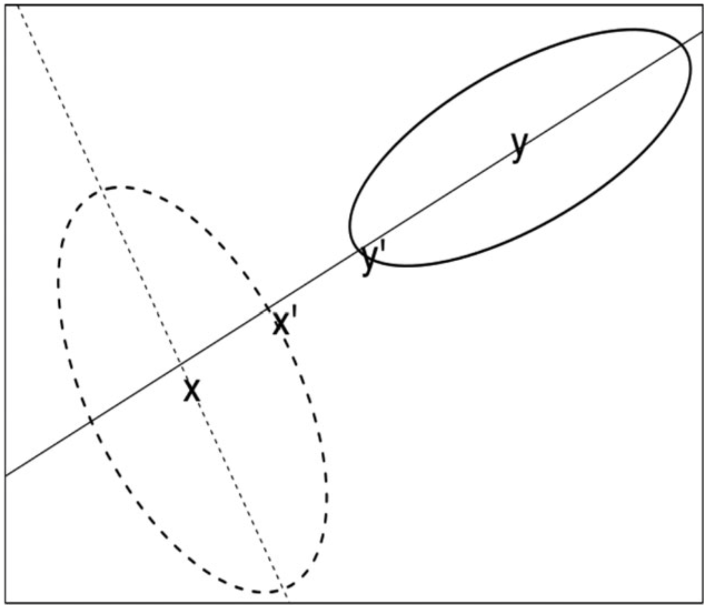

layout: true
class: left, middle

<div class="footer">`r academicons('osf')` <tt>osf.io/jhsfc</tt></div>

---
class: center, middle

```{r setup, include=FALSE}
library(icons)
library(tidyverse)
library(ggthemes)

options(htmltools.dir.version = FALSE)
knitr::opts_chunk$set(
  fig.width=9, fig.height=3.5, fig.retina=3,
  out.width = "100%",
  cache = FALSE,
  echo = TRUE,
  message = FALSE, 
  warning = FALSE,
  fig.show = TRUE,
  hiline = TRUE
)

theme_set(theme_clean() + theme(
      legend.title = element_text(face = 'bold', size=10),
      legend.text = element_text(size=10),
      legend.position = 'bottom',
      axis.title.x = element_text(size = 10, face='bold'),
      axis.title.y = element_text(size = 10, face='bold'),
      strip.text = element_text(size=10, face='bold'),
      plot.background = element_blank()
    ))
```

```{r xaringan-themer, include=FALSE, warning=FALSE}
library(xaringanthemer)
style_duo(
  primary_color = "#ffffff", 
  secondary_color = "#002145",
  text_font_google   = google_font("Montserrat", "400", "400i"),
  code_font_google   = google_font("Fira Mono"),
  header_h1_font_size = '3rem',
  header_h2_font_size = '2.25rem',
  header_h3_font_size = '1.75rem',
  text_font_size = '1.25rem',
  text_color = '#002145',
  code_inline_color = '#00A7E1',
  link_color = '#00A7E1'
)

# extra_css <- list(
#   ".small" = list("font-size" = "80%"),
#   ".big" = list("font-size" = "150%"),
#   ".footer" = list("position" = "absolute", "bottom" = "12px", "left"="20px", "font-size" = "80%")
# )
# style_extra_css(css = extra_css, outfile = "custom.css")
```


# Language contact within the bilingual: 
### Adapting a model from sound change to crosslinguistic influence
<br>
<div style="width: 100%;">
 <div style="float: left; width: 18%;" align=right></div>
  <div style="float: left; width: 64%;" align=center><br>Khia A. Johnson & Molly Babel <br>.small[Department of Linguistics<br>University of British Columbia]<br></div>
 <div style="float: left; width: 18%;" align=left></div>
 <br style="clear: left;" />
</div>

International Symposium on Bilingualism 13<br>
.small[July 13, 2021 · 12:00&ndash;13:30 CET · Session OS19: Cross-linguistic influence]


???
1: Hi, my name is Khia Johnson, and I'm presenting joint work with Molly Babel, which is based on a paper. You can find it at the OSF link in the slide footer.

---

## Time zone & bonus Q+A

- Session OS19 is 3am in our time zone &mdash; I'll be there, if a bit sleepy!

- Molly and I will hold an bonus Q+A session via Zoom on July 14 at 18:00 CET 
  
- Assuming you can comment on this video in the conference platform, I'll post the Zoom link there

???
A quick note about the time. I'll be at the Q+A session for this talk, but it's going to be 3am in my time zone, so I might be a bit sleepy. Molly and I will hold a bonus Q+A session on July 14 at 6pm central european time. I'll post the zoom link for that in the comments on this video.

---

## "...the locus of language contact is the bilingual speaker" [(Sankoff 2002: 643)](https://doi.org/10.1002/9780470756591.ch25)

???
I wanted to lead with this quote—the locus of language contact is the bilingual speaker. It ties ideas from crosslinguistic influence to ideas from research on language contact at the community level and suggests that the two are not different. This perspective emphasizes the role that bilinguals have to play in contact-induced language change.

---

## Crosslinguistic influence is...

- language contact at an individual level [(see Yao & Chang, 2016)](https://doi.org/10.1353/lan.2016.0031)

- bidirectional

- **asymmetrical**

???
Crosslinguistic influence is one clear example of contact, and it's arguable where contact-induced change starts. And while we might see it primarily as an individual-level phenomenon, examining how crosslinguistic influence patterns across a group of bilinguals can give us a snapshot of language contact at the community level. 

This contact manifests bidirectionally, and as we focus on in this research, it's also asymmetrical. So while any of an individual's languages is subject to influence from other languages, they don't necessarily exert the same influence. 

---

## Accounting for asymmetries

- Language dominance [(Flege & Bohn, 2021)](https://doi.org/10.1017/9781108886901.002)

- Age of acquisition [(Flege, Bohn, & Mackay, 1995)](https://doi.org/10.1121/1.413041)

- Language mode [(Simonet & Amengual, 2019)](https://doi.org/10.1177/1367006919826388)

- Recency [(Chang, 2013)](https://doi.org/10.1016/j.wocn.2013.09.006)
<br><br>
- **More room to vary** [(Bullock & Toribio, 2009;](https://benjamins.com/catalog/sibil.41.12bul) [Olson, 2016)](https://doi.org/10.1177/1367006914566204)

???
And there are accounts for much of this asymmetry. Some common ones include dominance, age of acquisition, language mode, and recency. These accounts cover a lot of ground and account for a wide variety of asymmetries. They largely reflect linguistic experience and are, by definition, highly individual in nature. 

Another proposal—one I've seen only anecdotally in the literature—is that there's something about the categories involved.

And that's the idea that some categories are more susceptible to influence because they have more room to vary. This explains why you see languages with long-lag voice onset time typically showing more influence from languages with short-lag voice onset time than the reverse. Your typical 80 milliseconds of aspiration could drop by half and still be perceived as long-lag. While short-lag stops are more tightly bounded on either side. 

So this idea of room to vary hasn't gained much traction in the crosslinguistic influence literature, but it is something you see in work on other kinds of language contact.

---

## "The division of labor between SLA and sociohistorical linguistics has led to the investigation of language contact at both ‘micro’ (individual) and ‘macro’ (community) levels" [(Yao & Chang, 2016)](https://doi.org/10.1353/lan.2016.0031)

???
There's not a great reason for why you don't see a ton of crosstalk between these different lines of research. And I think this quote from a recent Yao & Chang paper really highlights that. These micro and macro levels of language contact research have mostly stayed separate, despite how they might inform one another in interesting ways. And that's what we're doing here. Because the idea that categories in contact might differ in acceptable variability is something that's been grappled with in the sound change literature. 

---

## Adapting ideas from sound change

.pull-left[
- [Harrington et al. (2018)](https://doi.org/10.1111/tops.12329) account for direction of change based on distributional relationships alone

- For a given dimension (solid line), the more variable distribution (y) shifts towards the less variable distribution (x) over time

- Not the same as compactness [(Kartushina et al., 2015)](https://doi.org/10.1121/1.4926561)
]
.pull-right[
<br>
Figure 2 from Harrington et al. (2018)
]

???
A model of sound change proposed by Harrington and colleagues accounts for the direction of a sound change based purely on the relationship between two distributions. The figure here is pulled from their 2018 paper, and while it explains the model using two dimensions, it would work just as well for 1 or more than 2. So in this example, you have two versions of a category, X and Y, and you're interested in how these categories influence one another along the solid line. In this dimension, Y is much more variable than X. So, if you had something in the middle, you'd be more likely to say it's a Y than an X. This means that Y shifts towards X over time; and, Harrington and colleagues have demonstrated this with both modeling and empirical data. 

It's a bit weird to think about if you haven't before, but the basic idea is that the less variable group stands its ground while the more variable group closes in.

---

# Research question

When linked cross-language categories differ in the degree of phonetic variation for a given phonetic dimension, does the **less variable** category constrain or guide production of the **more variable** category in the other language?

**Hypothesis:** Yes, and this will be refined for each study

???
So what are we doing with this framework? Well. We're proposing that the internal structure of matched categories predicts asymmetry in crosslinguistic influence and that this has cascading effects for things like contact language varieties and sound change. 

While the original model offers an explanation for why specific sound changes occur, our adaptation of the model provides an account of how new changes might be introduced in the first place. 

---

## General method

- 2 studies examining English-Cantonese asymmetries **in English speech only**


- Materials
  - Cantonese-English bilingual corpus
  - Local English comparison corpus
  - Non-local English comparison corpus


- Identify target segments

- Measure and/or manually code

- Compare bilingual speech behavior to comparison groups with GLMMs

???
So, in broad terms, we follow a fairly standard corpus phonetics workflow. There are two studies, and each looks at a different asymmetry across English and Cantonese where we expect Cantonese influence on English. We use three corpora, each representing different speech communities: the bilinguals were focused on, and two English comparison corpora -- more about this on the next slide. We identified the segments of interest from the corpora and then measured or manually coded them, along with a host of control variables. With this data set, we compared bilinguals' speech production patterns to the comparison groups using generalized linear mixed-effects models.   
---

## More about the materials

- **SpiCE: Speech in Cantonese and English [(Johnson, 2021)](https://doi.org/10.5683/SP2/MJOXP3)**
  - Conversational interviews with Vancouver-based bilinguals 
  - English interviews only (n = 34)
  - Force-aligned
  

- **CTWCE: Corpus of Transnational West Coast English [(Swan, 2016)](http://doi.org/10.6082/M15T3HFT)**
  - Sociolinguistic interviews with Pacific Northwest English speakers
  - Vancouver-based participants with no Chinese language knowledge (n = 15)
  - Force-aligned
  

- **Buckeye Corpus of Conversational [English] Speech [(Pitt et al., 2005)](https://doi.org/10.1016/j.specom.2004.09.001)**
  - Conversational interviews with monolingual English speakers in Ohio, USA
  - Young participants only (n = 20)
  - Manually-aligned

???
Before I jump into the first study, I'll say a little bit more about the materials. The bilingual data comes from the English half of the SpiCE corpus, a new open-access bilingual speech corpus with conversational interviews that we've developed over the last few years here in Vancouver. The first of the comparison corpora is the Corpus of Transnational West Coast English. It's a collection of sociolinguistic interviews with English speakers in Seattle and Vancouver. We use a subset of talkers from Vancouver, that don't have any experience with any Chinese language—though many know some French. I'll refer to this as our "local comparison group." We also included a non-local comparison with the younger half of the Buckeye corpus, a widely used corpus of conversational monolingual English speech from the midwest of the United States. 

---

# Study 1: Intervocalic /bdg/ voicing

```{r bdg, include=FALSE}
bdg <- read_csv('data/isb_clean_bdg.csv')
bdg_spice <- read_csv('data/isb_clean_bdg_spice.csv')
```


???
On to the first study, where we look at voicing for voiced intervocalic stops

---

## English-Cantonese voicing asymmetry

.pull-left[

- English stop voicing is highly variable (Davidson, 2016)

- Cantonese lacks voiced stops (Bauer & Benedict, 2011)

- **Prediction:** Cantonese-English bilinguals will produce less stop voicing during closure in their English /bdg/ *in casual speech*, compared to local and non-local English speakers
]

.pull-right[
```{r voicing-asymmetry, echo=FALSE, fig.width = 4, fig.height=2.5, out.width='100%'}
dnorm_x <- function(x, m, s, mult) mult * dnorm(x, mean=m, sd=s)

ggplot(data = data.frame(x = c(0, 75)), aes(x)) +
  stat_function(fun = dnorm, n = 1000, args = list(mean = 15, sd = 5), size=1, aes(color='Cantonese')) + 
  stat_function(fun = dnorm_x, n = 1000, args = list(m = 40, s = 12, mult=2), size=1, aes(color='English')) + 
  geom_text(aes(x=18, y=0.075, hjust='left',label='Cantonese',  color='Cantonese', family = 'sans'), size=4) +
  geom_text(aes(x=51, y=0.05, hjust='left',label='English', color='English',  family = 'sans'), size=4) +
  ylab("") +
  xlab("") +
  scale_y_continuous(breaks = NULL) +
  scale_x_continuous(breaks = c(5,37.5,70), labels = c('Less', '<-- Voicing during closure -->', 'More')) +
  scale_color_viridis_d(option = 'magma', begin = 0,end=0.85) +
  theme_clean() +
  theme(legend.position = 'none')
```
]

???
This is a clear example of a variability asymmetry across English and Cantonese. The literature on English stops describes their voicing as highly variable. While it certainly depends on prosodic and other factors, the clear takeaway is its variability. However, the place you're most likely to see full voicing is between vowels inside a word. On the other hand, Cantonese lacks voiced obstruents entirely. So in one language, we see everything from full voicing to full devoicing, while in the other, we primarily see the latter. Though it's worth noting that we don't really see much in the literature that actually engages with the question of whether or not Cantonese stops voice under certain conditions. In casual speech, I think it's safe to assume that it happens at least some of the time. This is why in the cartoon diagram on the right, you see a wide distribution for English and a narrower one for Cantonese. The prediction is that bilinguals will produce less stop voicing in their English than the comparison groups. It's a case of the variable group getting pulled towards the invariable one. 

---

## Study 1: Methods

- **Identify** intervocalic, word-medial /bdg/

- **Manually code** as (1) Good, (2) Deletion, or (3) Transcript error

- **Measure** proportion of voicing during closure 

- **Model** proportion voiced as Beta-distributed response variable in GLMM

<br>
.small[
**lme4-style formula:** *Proportion Voiced ∼ Corpus × Place × Duration + Position + Stress Precedes + Stress Follows + Log Word Frequency + (1 | Word) + (1 + Place + Duration | Talker)*
]

???
So in this study, we identified all intervocalic, word-medial /bdg/ from all three corpora. We then manually coded tokens as good, deletion, or transcript error. While these coding labels were not crucial for the manually annotated Buckeye corpus, they bring the SpiCE and CTWCE corpora, which were force aligned, onto a level playing field. With our final set of "good" tokens, we then measured the proportion of voicing during closure and kept track of various control variables. Lastly, as the dependent variable here is a proportion derived from a continuous process, we modeled it as a Beta-distributed response variable in a Generalized linear mixed-effects model. I won't be going over model details in this talk. Instead, I refer you to our paper for more information on things like variable specification and coding.  

---
.left-column[
## Study 1: Main Result

All corpora have highly voiced stops, but bilinguals to lesser extent. 

The comparison is consistent and clear for /b/.

]
.right-column[
```{r bdg-results, echo=FALSE, fig.height=5, fig.width=7, out.width='100%'}

bdg$corpus <- fct_relevel(bdg$corpus, levels = c('SpiCE','CTWCE', 'Buckeye'))

bdg %>%
  ggplot(aes(y=prop_voiced, x=0, color=corpus)) +
  see::geom_violinhalf(aes(fill=corpus), trim = TRUE)+  
  geom_boxplot(aes(x=-.1), width = .15, outlier.shape=1, outlier.size = 1.5)+
  #geom_jitter(aes(x=-0.3), width=0.1, alpha=0.05, shape=16)+
  theme_clean() +
    scale_fill_viridis_d(option='magma', end=.8) + 
    scale_color_viridis_d(option='magma', end=.8) + 
    xlab('')+
    ylab('Proportion voiced') + 
    facet_grid(phone~corpus) +
  theme(legend.title = element_blank(),
        axis.text.x = element_blank(),
        axis.ticks.x = element_blank(),
        strip.text = element_text(face = 'bold', size=12), 
        panel.grid.major.y = element_blank(),
        panel.grid.major.x = element_line(linetype = 'dotted', color='lightgray'),
        panel.border = element_rect(fill=NA),
        legend.position = 'none'
        ) 
```
]

???
The main result from this study is consistent with our hypothesis. In this plot, each panel represents the distribution of proportion voiced for a particular corpus and stop. It does this with a pared boxplot and density plot. First off, this environment tends to be highly voiced, and that's apparent in every panel. That is a lot of fully voiced stops. However, it's also clear that talkers in the SpiCE corpus tend not to be quite as fully voiced. The distributions are more spread out, and the median value is lower.

On the other hand, the Buckeye corpus seems to have far more consistently fully voiced stops, with the median being full voicing for two of the three stops. CTWCE, our local comparison, shows more voicing than SpiCE for /b/, the stop for which we would be most likely to observe this difference. The other SpiCE versus CTWCE comparisons were not significant, though CTWCE seems to fall somewhere in the middle of the other two in this plot. 

---

## Study 1: Takeaways

- Bilinguals produce less voicing during closure

- Small effects, but environment strongly favors voicing

- Control effects all pattern as expected

???
The takeaway from study 1 is that, yes, our prediction held up. Bilinguals produce less voicing during closure. This difference is most evident with the non-local comparison but shows up with the local comparison as well. The effect size is relatively small, but given that this environment strongly favors voicing, it's not necessarily surprisingly small. We're comforted that the control variables—things like speech rate and stress—all pattern as expected. This makes us confident in the result. Lastly, while I don't have a slide for it, we also looked at some language mode variables within the SpiCE corpus.

---

## Study 1: Takeaways

.pull-left[
- Additional model demonstrates no significant effect of language mode

- Interview order trend follows expected pattern
]
.pull-right[
```{r interview-order, echo=FALSE, fig.height=3, fig.width=5, out.width='100%'}
bdg_spice  %>%
  mutate(canto_first = if_else(canto_first==TRUE, 'Cantonese First', 'English First')) %>%
  ggplot(aes(y=prop_voiced, x=0, color=canto_first)) +
  see::geom_violinhalf(aes(fill=canto_first), trim = TRUE)+  
  geom_boxplot(aes(x=-.1), width = .15, outlier.shape=1, outlier.size = 1.5) + 
  facet_wrap(~canto_first) +
    scale_fill_viridis_d(option='magma', end=.8) + 
    scale_color_viridis_d(option='magma', end=.8) + 
    xlab('')+
    ylab('Proportion voiced') + 
  theme(legend.title = element_blank(),
        axis.text.x = element_blank(),
        axis.ticks.x = element_blank(),
        strip.text = element_text(face = 'bold', size=12), 
        panel.grid.major.y = element_blank(),
        panel.grid.major.x = element_line(linetype = 'dotted', color='lightgray'),
        panel.border = element_rect(fill=NA),
        legend.position = 'none'
        ) 
```

]
???
... and in that additional model, there was little to no influence for either variable. We considered two things; first, the order of interview sessions in the SpiCE corpus. That is, whether an individual did the Cantonese session first or not. This was a marginal effect, and it patterned as expected, but it isn't something we can draw firm conclusions about. The second consideration was proximity to a code-switch, though there wasn't a ton of code-switching in the English interviews. We didn't see any effect in the model. 

---

# Study 2: Word-final /ptk/ releases

```{r ptk, include=FALSE}
tku <- read_csv('data/isb_clean_tku.csv')
tku_spice <- read_csv('data/isb_clean_tku_spice.csv')
```

???
Ok, so moving onto the second study. It has a similar structure but focuses on a different asymmetry.

---

## English-Cantonese release rate asymmetry
.pull-left[

- English stop releases are highly variable [(Davidson, 2011)]() and socially-conditioned [(Polinsky, 2018)]()

- Cantonese final stops are categorically *unreleased* [(Bauer & Benedict, 2011)]()

- **Prediction:** Bilinguals will be more likely to produce unreleased final stops in English /ptk/ in casual speech, compared to local and non-local English speakers
]

.pull-right[
```{r release-asymmetry, echo=FALSE, fig.width = 4, fig.height=3, out.width='100%'}
hm <- read_csv('r1/dummy_r1.csv') %>%
  mutate(
    Closure = if_else(closure=='Full', 'Full\nclosure', closure),
    Closure = if_else(closure=='Partial', 'Partial\nclosure', Closure),
    release = str_replace(release, '-','-\n'),
    release = if_else(closure=='Deletion', 'Deletion', release),
    count = if_else(closure=='Deletion', 7, count), 
    Language = if_else(Language=='English', 'E', 'C')
         )
ptkexplainer <- hm %>%  
  ggplot(aes(x=release, y=Closure, color=Language, label=Language, size=count)) +
  geom_label(data = subset(hm, Language=='E'))+
  geom_label(data = subset(hm, Language=='C'), position = position_nudge(x=.2, y=.2)) +
  scale_color_viridis_d(option = 'magma', begin = 0,end=0.85) +
  scale_size_continuous(range = c(3, 15)) +
  ylab("") +
  xlab("") +
  theme(legend.position = 'none')

ptkexplainer + 
  annotate("segment", x = 2.25, xend = 3.25, y = 1, yend = 1.5, size = 1, arrow = arrow(length = unit(.3,"cm"))) + 
  annotate("segment", x = 2.25, xend = 2.75, y = 1.02, yend = 1.27, size = 1, color='orange',arrow = arrow(length = unit(.3,"cm")))
```
]

???
Yet again, we have a clear example of asymmetry in which English is highly variable, and Cantonese is not. The example here final stop release rates. English stop releases are incredibly variable, which means you see clear releases, quasi-releases, non-releases, many forms of lenition, as well as deletion. This particular variable has some degree of social salience to it, so you'll see release rate vary across different social groups and speaking styles. Conversely, Cantonese stops are unreleased in final position. It's often discussed as a neutralization, though it's not entirely clear whether the long-lag or short-lag stops you see in initial position would be treated as the underlying form. Our prediction is that given the casual peer-to-peer speaking style, we would see Cantonese influence on English release patterns; specifically, bilinguals would be more likely to produce unreleased final stops, effectively mirroring their Cantonese. 

---

## Study 2: Methods

- **Identify** pre-vocalic and pre-approximant word-final /ptk/

- **Manually code** as (1) Released, (2) Unreleased, (3) Lenition, (4) Glottalization, (5) Deletion, or (6) Transcript error

- **Exclude** errors, deletions, and all /p/ tokens

- **Model** whether or not an item was *unreleased* using logistic GLMM

<br>
>.small[
**lme4-style formula:** Unreleased: True ∼ Corpus × Place × Rate + Vowel Precedes + Stress Precedes + Stress Follows + Word Frequency + (1 | Word) + (1 + Place × Rate | Talker)
]

???
Much like in Study 1, we identified the target items from all three corpora. These were word-final /ptk/, where the following word began with either a vowel or an approximant, as this environment encourages releases. We then manually coded the tokens into one of 6 categories. Released include clear and quasi releases. Unreleased tokens are characterized by clear closure but no release. While we coded for lenition and glottalization, we lumped these together in the analysis. Instances of deletion were removed, as were transcript errors. We also excluded all /p/ tokens from the analysis, as the counts were very low. We then modeled whether or not a stop surfaced as unreleased using a logistic mixed-effects model. While this might unfairly lump releases and lenition together, it gets at our core question of whether or not bilinguals are more likely to show Cantonese-like behavior.

---

.left-column[
## Study 2: Main Result

- Unreleased more likely for bilinguals

- No effect for interview order or code-switches

]
.right-column[
```{r tkresults, echo=FALSE, fig.width = 6, fig.height=4, out.width='100%'}
tku$phone <- fct_relevel(tku$phone, levels = c('T','K'))

tku %>%
  mutate(coded = if_else(cat==1, 'Released', if_else(cat==2, 'Unreleased', 'Lenition /\nGlottalization'))) %>%
  ggplot(aes(x=corpus, fill=coded)) +
    geom_bar(position = "fill") +
  xlab('Corpus') +
    ylab('Proportion') +
    scale_fill_viridis_d(option='magma', begin =.9, end=0.1) +
    facet_wrap(~phone, ncol = 2) +
    theme(
      legend.title = element_blank(),
      legend.position = 'right',
      legend.key.height = unit(0.5, 'in')
      )
```
]

???
The main result from Study 2 is that bilinguals are more likely to produce unreleased stops than either of the comparison groups. And notably, in the follow-up model, there was no effect of language mode as captured by interview order or proximity to a code switch. We also examined release rates for this study as opposed to the "unreleased rates just mentioned, and interestingly, we found that both Vancouver groups had remarkably low release rates, which points at a possible regional feature.

---
## Study 2: Takeaways

- Predictions borne out: Bilingual more likely to product unreleased final stops

- Small effects, but environment favors releases

- Control effects all pattern as expected

- Additional model (see paper) demonstrates no significant effect of language mode


???
So, the takeaway from Study 2 is that our hypothesis held up, albeit with small effect sizes. We anticipated that this environment would be conducive to releases and find that to be mostly true, except for the local groups' T productions. The control effects largely patterned as expected. T and K tokens interacted differently with duration, though we largely attribute this to the large percentage of Ks occurring in the word "like" -- and this is something we go into more in the paper. And lastly, there were not language mode effects detected, which is not to say they don't exist, but rather that our measures were perhaps inadequate for the purposes of detecting them.

---

# Dicussion

???
There's a lot to unpack in this study, and this talk is focused on the main points. But there are two things that I want to highlight in the discussion of this work. 

---

## Importance of corpus research

- Speaking style and communicative context matter
  - our results contradict prior lab results [(Polinsky, 2018)]()


- Capturing variable patterns requires... "natural" variation

- Lab + corpus = better theories and models in bilingualism [(Travis & Cacoullos, 2013)](https://doi.org/10.1080/07268602.2013.814529)


???
The first implication of this work, and one that may not have been as readily apparent in the takeaways from each study, is the importance of doing this kind of work with speech corpora. While it seems that our results contradict prior work on bilinguals' stop releases, this difference can be easily explained by speaking style. Polinsky did a study with Cantonese-English bilinguals in California and found them more likely to produce stop releases. Polinsky argued that it reflected that bilinguals might anticipate misperception occurring and thus hyperarticulate to mitigate that. We found the opposite. And the difference comes down to context. Polinsky's participants produced formal, citation-style speech, and presumably, the experimenter was not a member of their speech community.

On the other hand, our corpus work reflects peer-to-peer speech where the interviewer was a bilingual from the same speech community as the participant. This is precisely the kind of situation where clear speech and hyper-articulation aren't so necessary. And, we don't argue that releases never occur. They do, just less. 

So this feeds into the next point: to capture variable patterns, you need to have natural variation in the speech sample, which is harder to elicit in experimental work. Doing both lab studies and corpus studies represents a path to developing better theories and models. The second central part of the discussion is perhaps the more obvious one. 

---

## Differences in degree of phonetic variation can account for crosslinguistic influence asymmetry

- Builds on theoretical understanding of what happens to "linked" or "composite categories [(Flege & Bohn, 2021)]()

- A **proof of concept** in successful conceptual adaptation of sound change model from [Harrington et al. (2018)]()
  <br>&#10142; Claims should be tempered by single direction & small effect sizes

- **A testable, concrete mechanism** 
  <br>&#10142; we want to see how it holds up!

???
And that's our mind finding. The difference in the degree of phonetic variation offers an explanation for why crosslinguistic influence is asymmetrical. This finding builds on our understanding of crosslinguisitic influence, particularly with what happens to linked categories.

However, what we do in this research is perhaps best cast as a proof of concept. We successfully adapted a Harrington and colleagues model of sound change, at least on a conceptual level. There is plenty of room to build on this work! I say it's a proof of concept because there are a few limitations to this work that temper the strength with which we can make our claims. And that's the fact that we only look at influence in a single direction (Cantonese to English) and that many of the key results we presented ultimately stem from small effect sizes. 

So, while we present a testable, concrete mechanism, we're very interested to see how it holds up in our and others' future work.

---
## Acknowledgments

Thank you to Angelina Lloy, Christina Sen, and Stephanie Chung for assistance with data coding; Amanda Cardoso, Gloria Mellesmoen, and the Speech in Context Lab for comments on this work at various stages; Ivan Fong, Nancy Yiu, Ariana Zattera, Christina Sen and many others for their work on the SpiCE corpus; and, to the reviewers and editors for our manuscript, who have helped us improve this work substantially.

This work has been supported in part by funding from Canada’s [Social Sciences and Humanities Research Council](https://www.sshrc-crsh.gc.ca/) (MB), Canada’s [Natural Sciences and Engineering Research Council](https://www.nserc-crsng.gc.ca/) (MB), and a [UBC Public Scholars Initiative Award](https://www.grad.ubc.ca/psi) (KJ).

???
There are many people to thank for their contributions to this project, for helping create the SpiCE corpus, and for giving us feedback on the manuscript. 

---
class: top

### References + preprint `r academicons('osf')` 
Johnson, K. A., & Babel, M. (Under review). Language contact within the speaker: Phonetic variation and crosslinguistic influence. <https://osf.io/jhsfc/>

### Use our data `r academicons('open-access')`
Johnson, K. A. (2021). SpiCE: Speech in Cantonese and English. Scholars Portal Dataverse, V1. <https://doi.org/10.5683/SP2/MJOXP3>

### Connect with us! `r fontawesome('comments')`

khia.johnson@ubc.ca · @khia_johnson · [khiajohnson.com](https://khiajohnson.com) <br>
molly.babel@ubc.ca · @UBCSpeeCon · [speechincontext.arts.ubc.ca](https://speechincontext.arts.ubc.ca)

???
Lastly, we want to refer you to the paper for more details and our complete list of references. We also hope that you are inspired to your our data. The SpiCE corpus is free and available for download. We hope to see you in the Q+A session and elsewhere during ISB.